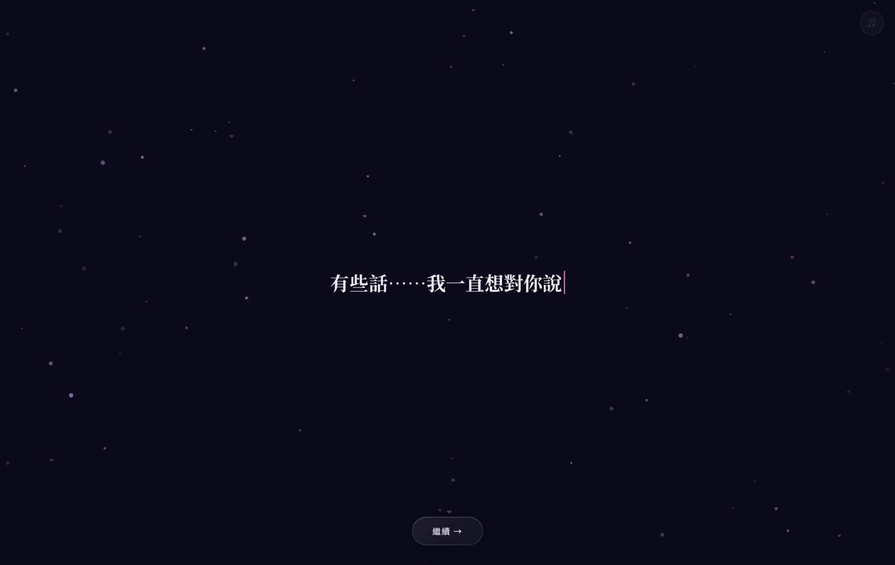
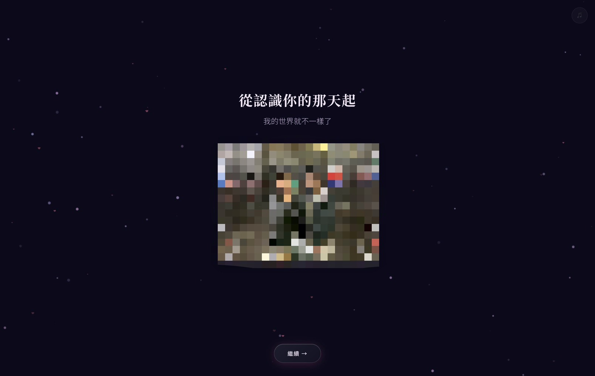
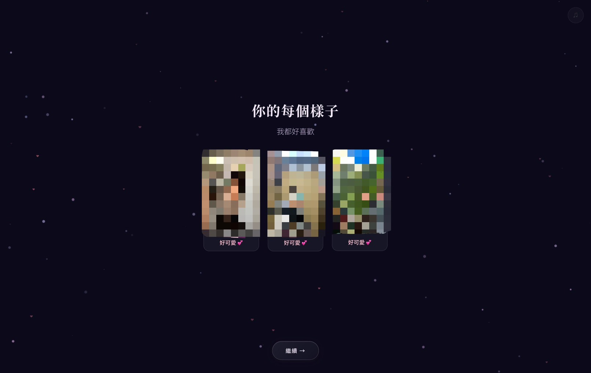
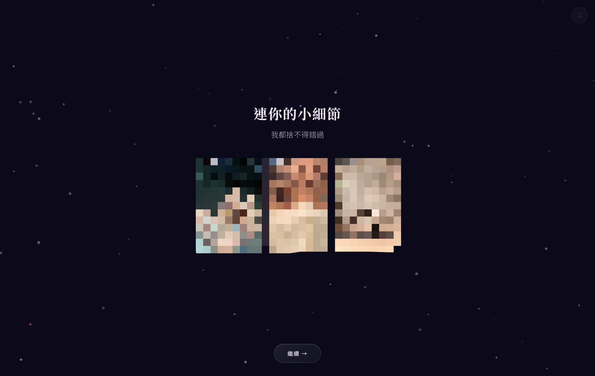
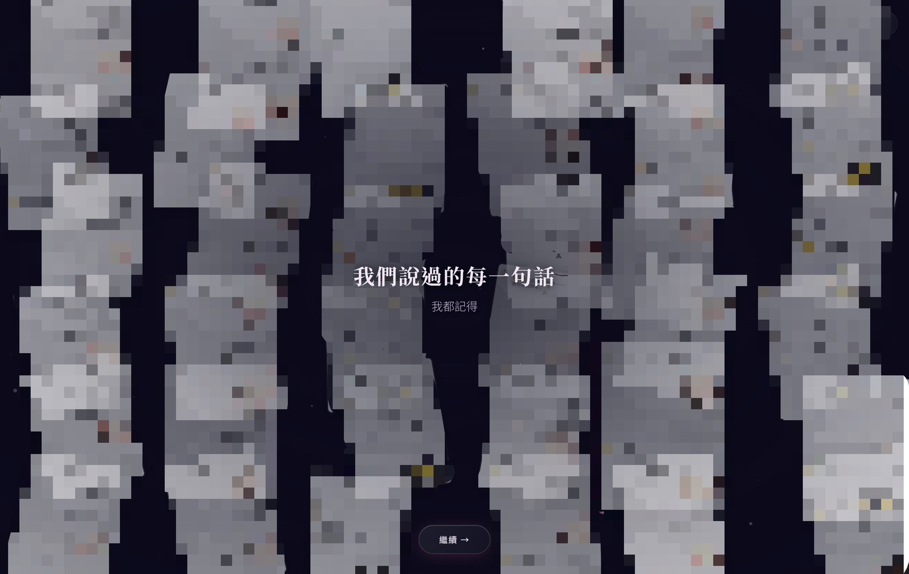
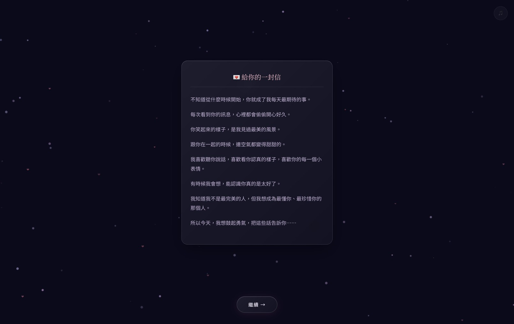
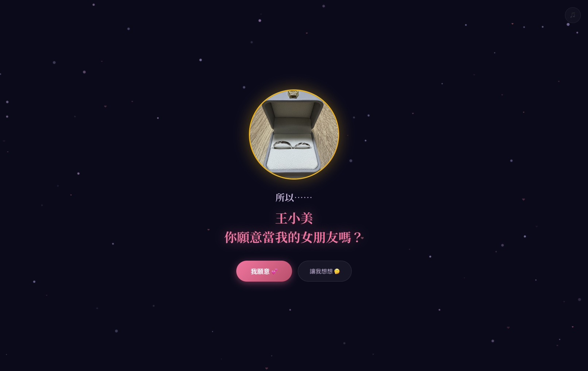
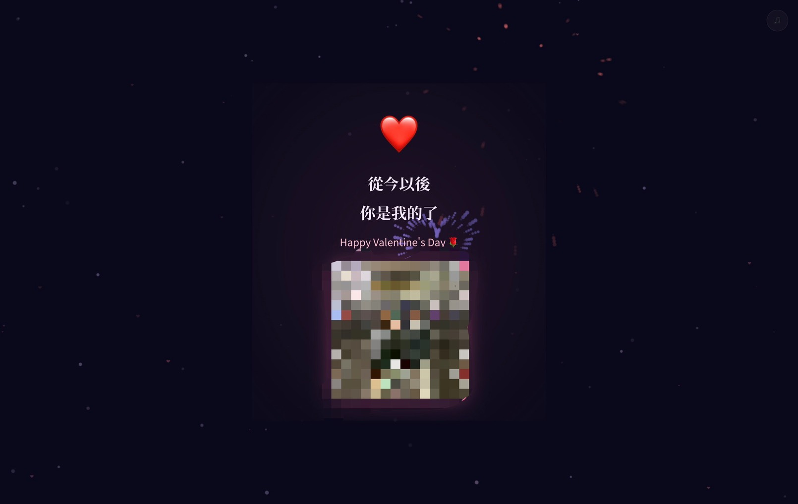

# 💌 Valentines Interactive Letter (情人節互動信)

這是一個動態且充滿互動感的情人節告白網頁模板。
設計上注重視覺體驗與驚喜感，包含星空打字機開場、漂浮記憶牆、粒子特效、煙火慶祝，以及專為行動裝置與電腦解析度最佳化的排版。

藉由這個模板，你可以輕鬆替換成自己的文字、照片與音樂，打造一份獨一無二的數位情書獻給特別的她/他。

## 📸 畫面預覽 (Screenshots)

<div style="display: flex; flex-wrap: wrap; gap: 10px; justify-content: center; margin-bottom: 20px;">
  
  
  
  
  
  
  
  
</div>

---

## ✨ 網站特色
- **沉浸式場景切換**：精心設計的 8 個場景，流暢過場不突兀
- **自訂性高**：照片缺失時會自動以美觀的 Emoji 顯示，無需修改程式碼即可預覽
- **立體特效**：Canvas 粒子飄散背景、照片 Hover 動畫、點擊告白成功後的絢麗煙火
- **漂浮記憶牆**：隨機動態漂浮的照片牆，並會定時高亮指定回憶
- **背景音樂支援**：右上方帶有音樂播放/暫停的微互動按鈕
- **RWD 響應式設計**：完美適配手機與電腦螢幕

## 🚀 快速上手 (Quick Start)

### 1. 取得專案
```bash
git clone https://github.com/platypus5566/valentines-interactive-letter.git
cd valentines-interactive-letter
```

### 2. 預覽網頁
取得專案後，直接在資料夾中雙擊打開 `index.html`，即可在瀏覽器中預覽網頁效果。

---

## 🛠️ 如何客製化你的內容？

為求簡單易用，所有的文字與照片設定都已統整到 `config.js` 檔案中，**你完全不需要修改 HTML 或任何複雜的程式碼**！

### 📝 1. 修改設定檔 (`config.js`)
使用文字編輯器（如記事本、VS Code）打開 `config.js`，你可以直接在裡面修改：
- 網頁標題 (`pageTitle`)
- 開場打字機文字 (`openingText`)
- 告白對象的名字 (`personName`) - **[⚠️ 必須修改]**
- 告白信的每一段文字 (`loveLetter`)

### 📸 2. 置換專屬照片
照片的資料夾結構位於 `photos/`，你可以將自己的照片放入對應資料夾，然後在 `config.js` 中把檔名填上即可，不限制只能叫什麼名稱！

- **`photos/together/`**: 放入具有特別意義的合照，並在 `config.js` 的 `firstMeet` 與 `finalPhoto` 填入該檔名。
- **`photos/cute/`**: 放入對方可愛的照片，並在 `config.js` 的 `cute` 陣列中增加對應檔名（不限數量）。
- **`photos/details/`**: 放入對方特寫照片（如美甲、美睫等），並在 `config.js` 的 `details` 陣列中修改你的專屬標籤文字與對應的標籤檔名。 - **[⚠️ 必須修改這裡來符合你們的故事]**
- **`photos/`**: 直接將戒指或禮物照片放在這個目錄下，並在 `config.js` 的 `ring` 設定檔名。
- **`photos/chats/`**: 放入漂浮記憶牆的點滴照片，並填寫在 `config.js` 的 `memoryWall` 中。如果不夠 30 張，網頁會自動重複使用來填滿畫面。

> **💡 小提示**：如果還沒有準備好照片也沒關係！找不到對應照片時，網頁會自動顯示成帶有 Emoji 的精美的預設佔位圖，不會破壞版面。

### 🎵 3. 置換背景音樂
將你的音樂重新命名為 `bgm.mp3`，並放入 `music/` 資料夾取代現有檔案即可。

---

## 📄 授權條款 (License)
本專案採用 [MIT License](LICENSE)，歡迎自由 Fork、修改及分享。祝福你告白成功！💕
